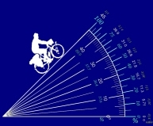
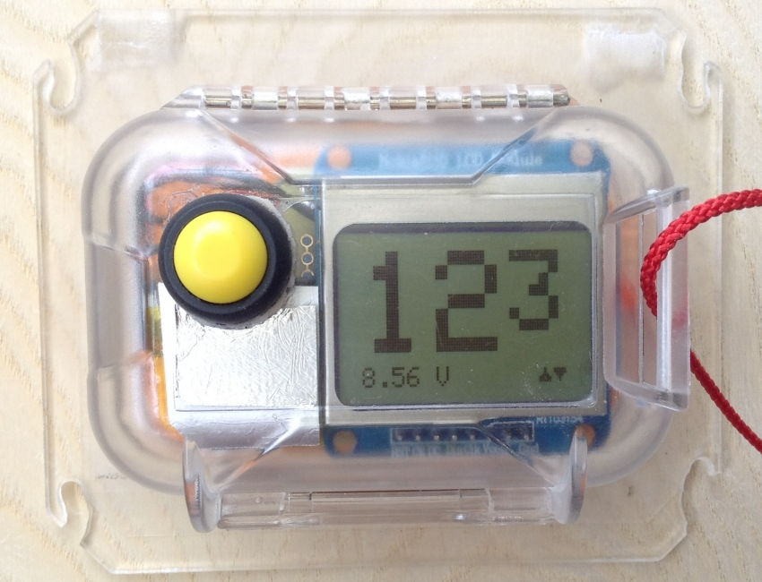

 

## Bicycle clinometer

The MPU6050 has a sophisticated built-in Digital Motion Processor which takes care of most of the maths-intensive sensor data integration and spits out directly usable data over I2C to the Arduino. In this single-task application we basically only need to track the tilt of one of the axes, the accelerometer's z-axis, which means only a fraction of the chips full capacity is being utilised now. To get to know this rather remarkable sensor, you're adviced to spend some time studying it's [datasheet](https://www.invensense.com/wp-content/uploads/2015/02/MPU-6000-Datasheet1.pdf)!

With the rather superb [MPU6050 library ](https://github.com/jrowberg/i2cdevlib/tree/master/Arduino/MPU6050)  written by Jeff Rowberg it is easy to get a prototype clinometer working for bench testing. In real-life testing it is soon evident that even the smallest variation in pedalling speed is sufficient to fool the accelerometer into "believing" it is being tilted back and forth a few degrees. 

To solve, or at least minimise, the influence of both cyclic and random forward/rearward acceleration forces, the number of samples was set to 10 per second (10Hz), which also means approximately 10 samples per pedal revolution, since a normal cadence  when climbing with a fully loaded touring bike probably hovers around 60-75 rpm. The sum of the sampled values is finally divided by 10, which smooths the output values considerably, while still being reasonably responsive, given the self-imposed constraint of the 1Hz display update rate. In the present version the algorithm also takes into account the sensor output's y-axis (horisontal) acceleration values, in an attempt to better filter out the actual "tilt" value only.

I find the notion of percent more intuitive than either fractional ratios or angular degrees, so the Nokia 5510 type LCD presents the grade as the percentage of the rise over the run (to use the technical terms), and updates each second.

The sensor needs to be calibrated first when mounted to a vehicle. The compensation value obtained then can be stored in EEPROM and automatically retrieved at start-up. 

Link to project description: https://sites.google.com/site/xnebmisc/home/clinometer 

 

 